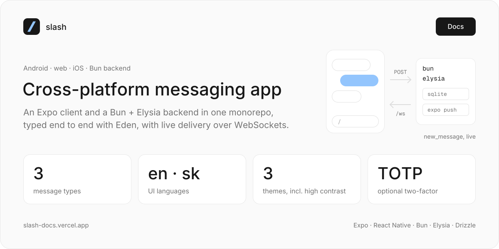
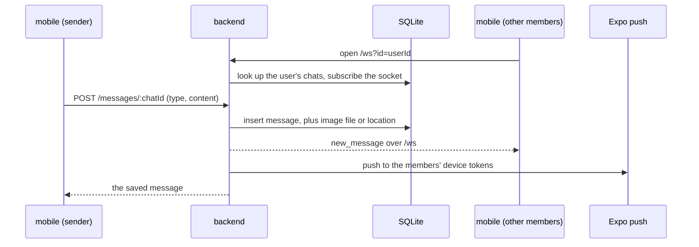
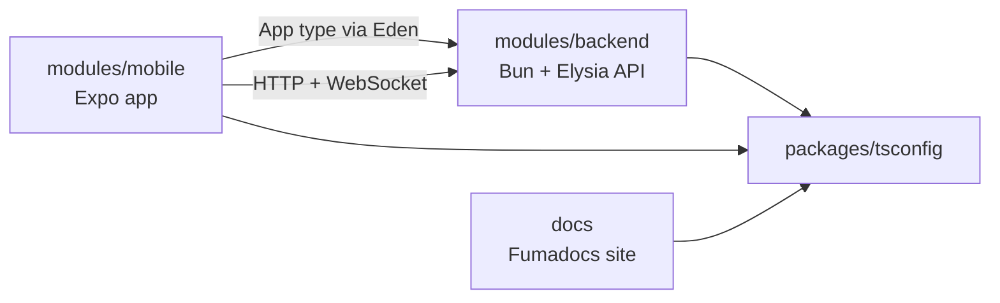

<a href="https://slash-docs.vercel.app"></a>

# /slash

cross-platform application JUST for messaging. an Expo / React Native client (Android, web, optional iOS) talks to a Bun + Elysia backend over HTTP and one WebSocket. the client imports the backend's `App` type through Eden, so there is no hand-written API client.

**[Docs →](https://slash-docs.vercel.app)**

built by [Artur Kozubov](https://github.com/justAnArthur) and [Artem Zaitsev](https://github.com/Aldeimeter) against the MTAA 2025 requirements (Figma, use cases and UAT are in the docs).

## What it does

- email + password sign-up and sign-in with Better Auth, optional TOTP two-factor
- private chats (one other user) and group chats with admin and member roles; pin and mute per chat
- text, image (camera or gallery) and location messages, paged history
- live delivery over `/ws` and Expo push notifications to the other members' devices
- English and Slovak UI; light, dark and high-contrast themes

## Run

the backend and the app are Bun workspaces; install once at the root (`postinstall` also sets up lefthook):

```bash
bun install
```

backend, from `modules/backend`:

```bash
cp .env.example .env     # PORT, HOSTNAME, FRONTEND_URL; AXIOM_API_TOKEN + AXIOM_DATASET send OpenTelemetry traces to Axiom
bun migration:run        # applies sqlite/migrations to sqlite/slash.sqlite (override with DB=)
bun dev                  # http://localhost:3000, Swagger UI at /swagger
ngrok http 3000          # in another terminal, so a phone can reach it
```

app, from `modules/mobile`:

```bash
cp .env.example .env     # EXPO_PUBLIC_BACKEND_URL=https://***.ngrok-free.app/ (http(s) is swapped for wss:// for the socket)
bun run dev --clear      # Expo dev server: browser preview, Expo Go, Android emulator, iOS simulator, dev build
```

the app uses [file-based routing](https://docs.expo.dev/router/introduction): screens live in `modules/mobile/app`.

## How it works

the backend keeps an in-memory map of chat → open sockets. a client opens `/ws?id=<user id>` after sign-in and is subscribed to all of its chats; a new message is stored, broadcast to that map and pushed to everyone else in the chat.



everything except `/api/auth/*` (Better Auth) sits behind the auth middleware: `/users`, `/chats`, `/messages`, `/files`. the database is SQLite through Drizzle (`bun:sqlite`, WAL mode); the schema and its ER diagram are on the [architecture page](https://slash-docs.vercel.app/docs/architecture).

## Structure

```
modules/backend      @slash/backend: Bun + Elysia API, Drizzle on SQLite, Better Auth, Swagger, OpenTelemetry
modules/mobile       @slash/mobile: Expo Router app, Eden client typed from the backend, i18n-js (en, sk)
packages/tsconfig    @slash/tsconfig: shared base tsconfig
docs/                Fumadocs (Next.js) site, deployed at slash-docs.vercel.app
.releases/02/        snapshot of the docs' MDX for release 02
.linked/             google-services.json for the Android build (referenced from app.json)
```



`modules/backend` and `modules/mobile` used to be the separate `slash-backend` and `slash-mobile` repos; both were merged in here with their full history.

## Docs

`docs/` is a [Fumadocs](https://fumadocs.vercel.app) site; the pages are MDX in `docs/content/docs`, Mermaid diagrams included.

| section | pages |
|---|---|
| introduction | what /slash is, authors, activity |
| tech overview | architecture (deployment and ER diagrams), tech stack, third-party APIs |
| project overview | platforms, use cases |
| design | Figma |
| tests | UAT |

```bash
cd docs
bun install              # not a workspace; it has its own lockfile
bun dev                  # http://localhost:3000, redirects to /docs
```

`.releases/02/mdx-files` keeps the same pages as they were for the GitHub release `02`. code docs for the app come from TypeDoc: `bun run docs` in `modules/mobile` writes them to `modules/mobile/.docs` (git-ignored).

## Develop

```bash
bun run biome:check                      # Biome format + lint, from the root
bun run --cwd modules/backend test
bun run --cwd modules/mobile test        # jest-expo, watch mode
```

## Deploy

- backend: `bun run build:linux-x64` (or `build:windows-x64`) in `modules/backend` compiles one `server` binary; `example-systemd.slash-bun.service` runs it under systemd
- app: EAS builds from `modules/mobile/eas.json` (`development`, `preview` APK, `production`); `preview` and `production` point at `https://slash-backend.justadomainname.dev`
- docs: [slash-docs.vercel.app](https://slash-docs.vercel.app)

## Activity


