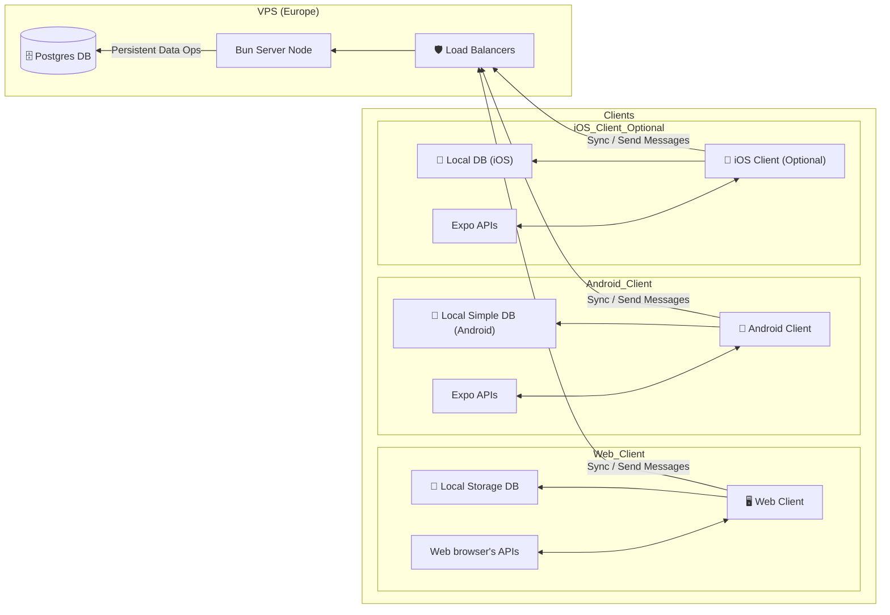
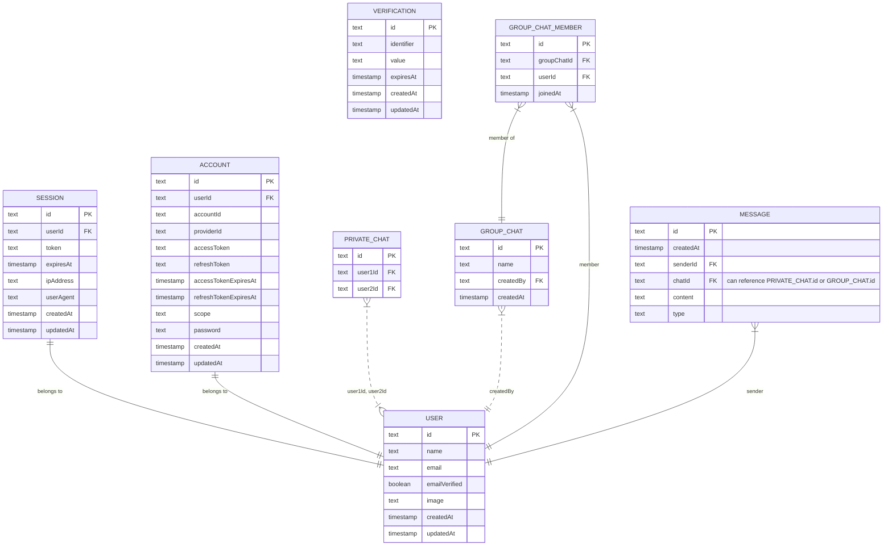
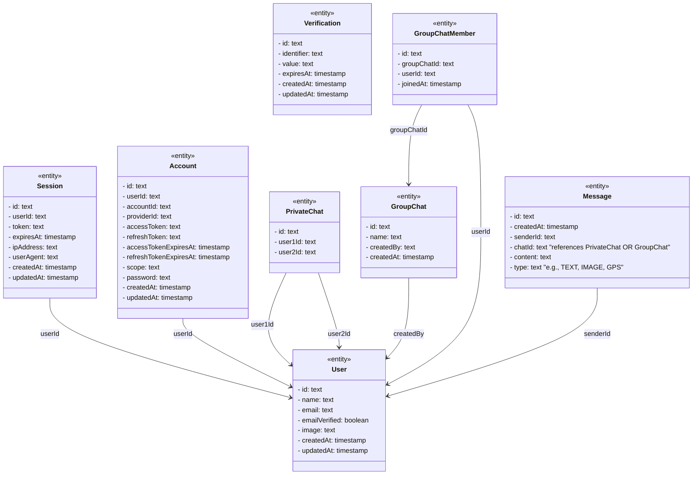

Based on requirements and our experience, we decided to use the following architecture:

```mermaid
flowchart RL
  subgraph Clients
    subgraph Web_Client
        A[🖥 Web Client]
        A1["📂 Local Storage DB"]
        A2["Web browser's APIs"]
    end
    subgraph Android_Client
        B[🤖 Android Client]
        B1["📂 Local Simple DB (Android)"]
        B2["Expo APIs"]
    end
    subgraph iOS_Client_Optional
        C["🍏 iOS Client (Optional)"]
        C1["📂 Local DB (iOS)"]
        C2["Expo APIs"]
    end
  end

  A --> A1
  B --> B1
  C --> C1
  A <--> A2
  B <--> B2
  C <--> C2

  subgraph "VPS (Europe)"
    LB[🛡 Load Balancers]
    BS[Bun Server Node]

    DB[(🗄️ Postgres DB)]
  end

  A -- "Sync / Send Messages" --> LB
  B -- "Sync / Send Messages" --> LB
  C -- "Sync / Send Messages" --> LB

  LB --> BS

  BS -- "Persistent Data Ops" --> DB
```

## Database Architecture

### Entity-Relationship diagram

```mermaid
erDiagram
    USER {
      text id PK
      text name
      text email
      boolean emailVerified
      text image
      timestamp createdAt
      timestamp updatedAt
    }

    SESSION {
      text id PK
      text userId FK
      text token
      timestamp expiresAt
      text ipAddress
      text userAgent
      timestamp createdAt
      timestamp updatedAt
    }

    ACCOUNT {
      text id PK
      text userId FK
      text accountId
      text providerId
      text accessToken
      text refreshToken
      timestamp accessTokenExpiresAt
      timestamp refreshTokenExpiresAt
      text scope
      text password
      timestamp createdAt
      timestamp updatedAt
    }

    VERIFICATION {
      text id PK
      text identifier
      text value
      timestamp expiresAt
      timestamp createdAt
      timestamp updatedAt
    }

    PRIVATE_CHAT {
      text id PK
      text user1Id FK
      text user2Id FK
    }

    GROUP_CHAT {
      text id PK
      text name
      text createdBy FK
      timestamp createdAt
    }

    GROUP_CHAT_MEMBER {
      text id PK
      text groupChatId FK
      text userId FK
      timestamp joinedAt
    }

    MESSAGE {
      text id PK
      timestamp createdAt
      text senderId FK
      text chatId FK "can reference PRIVATE_CHAT.id or GROUP_CHAT.id"
      text content
      text type
    }

    %% Relationships
    SESSION ||--|| USER : "belongs to"
    ACCOUNT ||--|| USER : "belongs to"
    PRIVATE_CHAT }|..|{ USER : "user1Id, user2Id"
    GROUP_CHAT }|..|| USER : "createdBy"
    GROUP_CHAT_MEMBER }|--|| GROUP_CHAT : "member of"
    GROUP_CHAT_MEMBER }|--|| USER : "member"
    MESSAGE }|--|| USER : "sender"
```

### Class diagram

```mermaid
classDiagram
    class User {
      <<entity>>
      - id: text
      - name: text
      - email: text
      - emailVerified: boolean
      - image: text
      - createdAt: timestamp
      - updatedAt: timestamp
    }

    class Session {
      <<entity>>
      - id: text
      - userId: text
      - token: text
      - expiresAt: timestamp
      - ipAddress: text
      - userAgent: text
      - createdAt: timestamp
      - updatedAt: timestamp
    }

    class Account {
      <<entity>>
      - id: text
      - userId: text
      - accountId: text
      - providerId: text
      - accessToken: text
      - refreshToken: text
      - accessTokenExpiresAt: timestamp
      - refreshTokenExpiresAt: timestamp
      - scope: text
      - password: text
      - createdAt: timestamp
      - updatedAt: timestamp
    }

    class Verification {
      <<entity>>
      - id: text
      - identifier: text
      - value: text
      - expiresAt: timestamp
      - createdAt: timestamp
      - updatedAt: timestamp
    }

    class PrivateChat {
      <<entity>>
      - id: text
      - user1Id: text
      - user2Id: text
    }

    class GroupChat {
      <<entity>>
      - id: text
      - name: text
      - createdBy: text
      - createdAt: timestamp
    }

    class GroupChatMember {
      <<entity>>
      - id: text
      - groupChatId: text
      - userId: text
      - joinedAt: timestamp
    }

    class Message {
      <<entity>>
      - id: text
      - createdAt: timestamp
      - senderId: text
      - chatId: text  "references PrivateChat OR GroupChat"
      - content: text
      - type: text    "e.g., TEXT, IMAGE, GPS"
    }

    %% Associations
    Session --> User : userId
    Account --> User : userId
    PrivateChat --> User : user1Id
    PrivateChat --> User : user2Id
    GroupChat --> User : createdBy
    GroupChatMember --> GroupChat : groupChatId
    GroupChatMember --> User : userId
    Message --> User : senderId
    %% Note: Message.chatId may refer to either a PrivateChat or a GroupChat
```