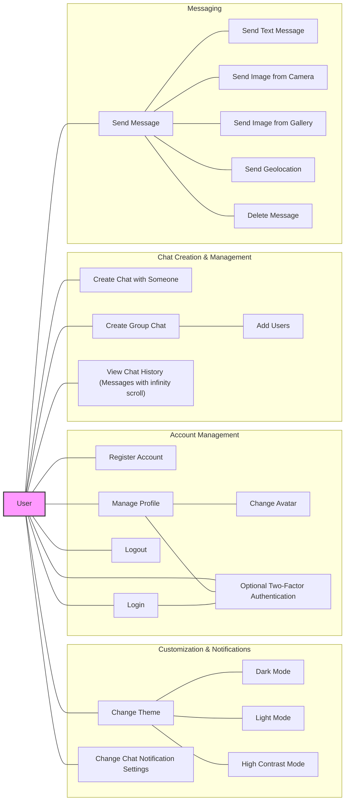
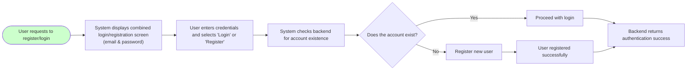
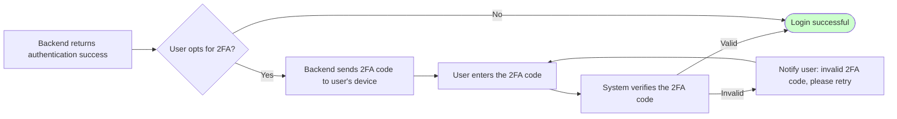

```mermaid
flowchart LR
    %% actor
    U[User]

    subgraph Customization["Customization & Notifications"]
        CN1[Change Theme]
        CN2[Dark Mode]
        CN3[Light Mode]
        CN4[High Contrast Mode]
        CN5[Change Chat Notification Settings]
    end

    subgraph AccountManagement["Account Management"]
        AM1[Register Account]
        AM2[Login]
        AM3[Logout]
        AM4[Manage Profile]
        AM5[Change Avatar]
        AM7[Optional Two-Factor Authentication]
    end

    subgraph ChatManagement["Chat Creation & Management"]
        CMg1[Create Chat with Someone]
        CMg2[Create Group Chat]
        CMg3[Add Users]
        CMg5["View Chat History (Messages with infinity scroll)"]
    end

    subgraph Messaging["Messaging"]
        M1[Send Message]
        M2[Send Text Message]
        M3[Send Image from Camera]
        M4[Send Image from Gallery]
        M5[Send Geolocation]
        M8[Delete Message]
    end

    U --- AM1
    U --- AM2
    U --- AM3
    U --- AM4
    U --- AM7

    AM4 --- AM5
    AM4 --- AM7
    AM2 --- AM7

    U --- CMg1
    U --- CMg2
    CMg2 --- CMg3
    U --- CMg5

    U --- M1
    M1 --- M2
    M1 --- M3
    M1 --- M4
    M1 --- M5
    M1 --- M8

    U --- CN1
    CN1 --- CN2
    CN1 --- CN3
    CN1 --- CN4
    U --- CN5

    classDef actorStyle fill:#f9f,stroke:#333,stroke-width:2px;
    class U actorStyle;
```

## Authorization

```mermaid
flowchart LR
    TRIGGER([User requests to register/login])
    style TRIGGER fill:#cfc
    TRIGGER --> S1["System displays combined login/registration screen<br/>(email &amp; password)"]
    S1 --> S2["User enters credentials and selects 'Login' or 'Register'"]
    S2 --> S3[System checks backend for account existence]
    S3 --> S4{Does the account exist?}
    S4 -- Yes --> S5[Proceed with login]
    S4 -- No --> S6[Register new user]
    S6 --> S7[User registered successfully]
    S5 & S7 --> S8[Backend returns authentication success]
```

### Optional Two-Factor Authentication:

```mermaid
flowchart LR
    S8[Backend returns authentication success]
    S8 --> OPT{User opts for 2FA?}
    OPT -- Yes --> S9[Backend sends 2FA code to user's device]
    S9 --> S10[User enters the 2FA code]
    S10 --> S11[System verifies the 2FA code]
    S11 -- Valid --> SUCCESS([Login successful])
    S11 -- Invalid --> EXT1[Notify user: invalid 2FA code, please retry] --> S10
    OPT -- No --> SUCCESS
    style SUCCESS fill:#cfc
```

## Chat message sending

```mermaid
flowchart LR
  %% Trigger event: User selects a chat
  TRIGGER([User selects a chat]) --> CHOICE;
  style TRIGGER fill:#ccf

  %% User chooses action: text or attachment
  CHOICE[User chooses action:<br>- Enter text message<br>- Click attachment button] --> DECIDE;

  %% Decision: is a text message entered?
  DECIDE{Did the user enter a text message?}

  %% Text Message Flow
  DECIDE -- Yes --> SENDTEXT["User clicks 'Send' for text message"]
  SENDTEXT --> LOCALSYNC[Text message saved in local storage]
  LOCALSYNC --> SENDSERVER[Text message sent to server]
  SENDSERVER --> CHECKTEXT{Was text message sent successfully?}
  CHECKTEXT -- Yes --> TEXTSUCCESS[Text message delivered]
  CHECKTEXT -- No --> RETRYTEXT[Prompt user to retry sending text message]

  %% Attachment Flow
  DECIDE -- No --> ATTACHFLOW[User clicks attachment button]
  ATTACHFLOW --> CHOOSEATTACH[User selects attachment type]

  %% Attachment Options: Camera, Gallery, or Geo-location
  CHOOSEATTACH --> CAMERA[Select image from camera]
  CHOOSEATTACH --> GALLERY[Select image from gallery]
  CHOOSEATTACH --> GEO[Select current geo location]

  %% Preview before sending attachment
  CAMERA --> PREVIEWCAM[Preview camera image]
  GALLERY --> PREVIEWGAL[Preview gallery image]
  GEO --> PREVIEWGEO[Preview geo location]

  %% All previews lead to sending attachment
  PREVIEWCAM --> SENDATTACH;
  PREVIEWGAL --> SENDATTACH;
  PREVIEWGEO --> SENDATTACH;

  SENDATTACH["User clicks 'Send' for attachment"]
      --> LOCALSYNC2[Attachment synced in local storage]
      --> SENDSERVER2[Attachment sent to server]
      --> CHECKATTACH{Was attachment sent successfully?}
  CHECKATTACH -- Yes --> ATTACHSUCCESS[Attachment delivered]
  CHECKATTACH -- No --> RETRYATTACH[Prompt user to retry sending attachment]
```