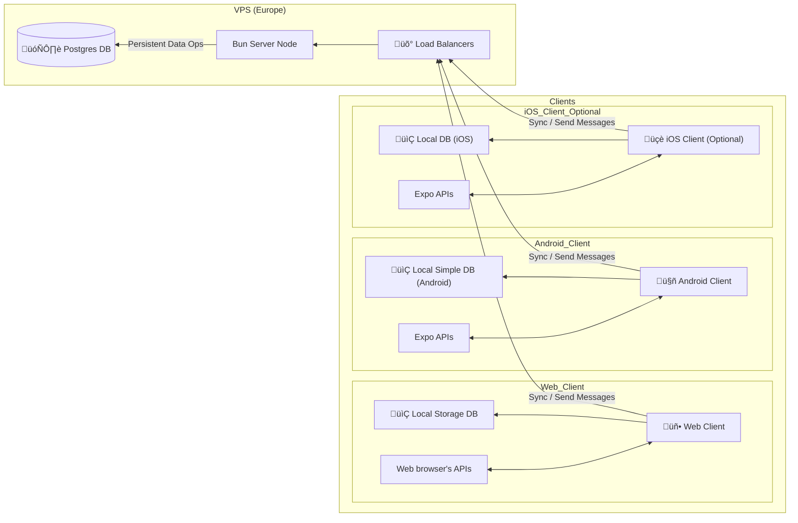

import { Accordion, Accordions } from 'fumadocs-ui/components/accordion';
import { Step, Steps } from 'fumadocs-ui/components/steps';

## Introduction

Chat – a simple word for a simple app. No nuclear collider of pointless, useless features here. As a developer who thinks WordPress is shit and would rather build something fresh from the ground several times, I wanted an app that’s as straightforward as its name.

C – Cross-platform:
I'm not a tech-giant to have time and money to batter with one button looking the same on different devices and platforms. So... we have choice: React-Native. That is not just a web-view (based on MTAA requirements), JS ❤️, and good, excellent ecosystem.

H – Huge Performance:
I'm a programmer, and if my system doesn’t boot in a second, it’s bullshit. Sure, React Native might throw a wrench in the works sometimes, but in good hands and with a little clever tinkering it’s fast as hell (don't know why hell is fast). And on the backend, we’re using Bun to keep message sending lightning quick.

A – Atomicity:
When millions of messages are flying around, reliability is non-negotiable. With Bun and Elysia (plus their awesome plugins), every message is handled solidly, with logs and stats that actually mean something.

T – Touch-Friendly:
I don't like when mobile application are designed like I am using the phone with two hands. **I CANNOT CLICK ON LEFT TOP CORNER BUTTON**. That is even better on iphoneos that does not support gestures, and you need to touch in that corner several times.

So... Simple, Fast, Atomic, and (most importantly) Easy to use.

### Authors

<Cards>
    <Card
        title="Artur Kozubov" href="https://github.com/justAnArthur"
        description="Billionaire, genius, playboy and philanthropist."
        icon={
            
        }
    />
    <Card
        title="Artem Zaitsev" href="https://github.com/Aldeimeter"
        description="*Where is your avatar?"
        icon={
            
        }
    />
</Cards>

## Tech Overview

### Tech stack

    

        
        <b>React Native</b>
        

            Is a JavaScript framework for writing real, natively rendering mobile applications for iOS and Android, Web.
        

    

    

        
        <b style={{display: "hidden"}}>Expo</b>
        

            Is an additional framework for React Native that allows you to build, deploy, and publish applications
            without pain.
        

    

    

        
        <b>Elysia</b>
        

            TypeScript framework supercharged by Bun with End-to-End Type Safety, unified type system, and outstanding
            developer experience.
        

    

    

        
        <b>Elysia/Eden</b>
        

            End-to-end type safety is like making sure all the pieces of the track match up correctly so the train
            doesn't fall off or get stuck.
        

    

    

        
        <b>Bun</b>
        

            Is an all-in-one toolkit for JavaScript and TypeScript apps.
        

    

    

        
        <b>Drizzle</b>
        

            It’s the only ORM with both relational and SQL-like query APIs. Is lightweight, performant, typesafe,
            non-lactose, gluten-free, sober, flexible and serverless-ready by design.
        

    

    

        <b>i18n-js</b>
        

            A small library to provide the i18n translations on the JavaScript.
        

    

    

        
        <b>Typedoc</b>
        

            Is a documentation generator for TypeScript projects.
        

    

### Architecture

Based on requirements and our experience, we decided to use the following architecture:

#### Database Architecture

##### Entity-Relationship diagram

##### Class diagram

## Project Overview

### Pointed platforms

#### Front-end

Based on possibilities of React Native, we can build applications for iOS, **Android**, and **Web**. Due to limitation of non-using and negative experience about iOS/iPhones we are not sure about shipping iOS build.

So primary we are focusing on stable Android and Web builds, with optional iOS.

#### Back-end

The back-end is built on Elysia, which is a TypeScript framework supercharged by Bun. With possibilities of Bun - it can be built to binary and run on every machine.

Primary, production target is **Linux**, and developing include **Windows**.

### Use cases

TODO

### UATs
<Accordions>
**Positive tests**

<Accordion title="Test 1: Create new account">

**Input conditions:**
User has an internet connection. User provides a valid email, username, and password. Password meets security requirements (e.g., length, special characters).

**Output conditions:**
User receives a success message. User is redirected to the chat list page.

**Steps:**
<Steps>
<Step>
Open the app and navigate to the registration page.
</Step>
<Step>
Enter a valid email, username, and password.
</Step>
<Step>
Click the "Continue" button.
</Step>
<Step>
Add profile description and avatar.
</Step>
<Step>
Click "Sign Up".
</Step>
</Steps>
**Result:** PASS/FAIL.
</Accordion>
<Accordion title="Test 2: Send message with geolocation">

**Input conditions:**
User has an internet connection. User is logged in. User has a chat with another user.

**Output conditions:**
Message with geolocation is sent.

**Steps:**
<Steps>
<Step>
1. Open the app and navigate to the existing chat.
</Step>
<Step>
2. Click "Attachments" button.
</Step>
<Step>
3. Click "Geolocation" button.
</Step>
<Step>
4. Allow location permissions if prompted.
</Step>
<Step>
5. Click "Send" button.
</Step>
</Steps>
**Result:** PASS/FAIL.
</Accordion>
<Accordion title="Test 3: Create new chat">

**Test 3:** Create new chat

**Input conditions**:
User has an internet connection. User is logged in. User knows another username.

**Output conditions:**
A new chat is created. Both users can see the chat.

**Steps:**
<Steps>
<Step>
1. Open the app and navigate to the chat list page.
</Step>
<Step>
2. Click the “+” button at the bottom.
</Step>
<Step>
3. Type existing username in the search field.
</Step>
<Step>
4. Choose user.
</Step>
<Step>
5. Write message and click send.
</Step>
</Steps>
**Result:** PASS/FAIL.
</Accordion>
<Accordion title="Test 4: Change user avatar">

**Test 4:** Change user avatar

**Input conditions:**
User has an internet connection. User is logged in.

**Output conditions:**
User sees a new avatar.

**Steps:**
<Steps>
<Step>
1. Open the app and navigate to the settings page.
</Step>
<Step>
2. Click “change avatar”.
</Step>
<Step>
3. Choose a photo from the gallery or take a new photo.
</Step>
<Step>
4. Cut it as you want.
</Step>
<Step>
5. Click confirm.
</Step>
</Steps>
**Result:** PASS/FAIL.
</Accordion>
<Accordion title="Test 5: Set up 2FA with Google Authenticator">

**Test 5:** Set up 2FA with Google Authenticator

**Input conditions:**
User has an internet connection. User is logged in. User has Google Authenticator.

**Output conditions:**
User sees a success message for 2FA setup.

**Steps:**
<Steps>
<Step>
1. Open the app and navigate to the settings page.
</Step>
<Step>
2. Click "Set up 2FA" button.
</Step>
<Step>
3. Copy code from screen.
</Step>
<Step>
4. Go to Google Authenticator app and paste copied code.
</Step>
<Step>
5. Enter additional info for Google Authenticator.
</Step>
<Step>
6. Enter an OTP code from Google Authenticator into the app.
</Step>
</Steps>
**Result:** PASS/FAIL.
</Accordion>
<Accordion title="Test 6: Mute chat notifications">

**Test 6:** Mute chat notifications

**Input conditions:**
User has an internet connection. User is logged in. User has at least one active chat.

**Output conditions:**
Notifications for the muted chat are disabled.

**Steps:**
<Steps>
<Step>
1. Open the app and navigate to the chat list.
</Step>
<Step>
2. Long press on a chat to reveal options.
</Step>
<Step>
3. Select the "Mute Notifications" option.
</Step>
<Step>
4. Choose a mute duration (e.g., 1 hour, 8 hours, or indefinitely).
</Step>
<Step>
5. Verify that the chat now shows a muted icon, and notifications are not received.
</Step>
</Steps>
**Result:** PASS/FAIL.
</Accordion>
<Accordion title="Test 7: Delete a chat">

**Test 7:** Delete a chat

**Input conditions:**
User has an internet connection. User is logged in. User has at least one chat in the chat list.

**Output conditions:**
The selected chat is removed from the chat list.

**Steps:**
<Steps>
<Step>
1. Open the app and navigate to the chat list.
</Step>
<Step>
2. Long press on the chat to reveal options.
</Step>
<Step>
3. Select "Delete" from the available options.
</Step>
<Step>
4. Confirm the deletion in the popup.
</Step>
<Step>
5. Check that the chat no longer appears in the list.
</Step>
</Steps>
**Result:** PASS/FAIL.

</Accordion>
**Negative tests**

<Accordion title="Test 8: Create account with invalid email">

**Input conditions:**
User has an internet connection. User enters an incorrectly formatted email (e.g., "userexample.com").

**Output conditions:**
The app displays an error message: "Invalid email format." The account is not created, and the user is not redirected.

**Steps:**
<Steps>
<Step>
1. Open the app and navigate to the registration page.
</Step>
<Step>
2. Enter a valid username and password.
</Step>
<Step>
3. Enter an invalid email (e.g., "usernamedomain").
</Step>
<Step>
4. Click the "Sign up" button.
</Step>
<Step>
5. Read the error message displayed.
</Step>
</Steps>
**Result:** PASS/FAIL.
</Accordion>
<Accordion title="Test 9: Change user avatar with too large file (1MB+)">
**Test 9:** Change user avatar with too large file (1MB+)

**Input conditions:**
User has an internet connection. User is logged in.

**Output conditions:**
User sees an error message telling that the inserted file is too big.

**Steps:**
<Steps>
<Step>
1. Open the app and navigate to the settings page.
</Step>
<Step>
2. Click "change avatar".
</Step>
<Step>
3. Choose a photo from the gallery which is too large.
</Step>
<Step>
4. Cut it as you want.
</Step>
<Step>
5. Click confirm.
</Step>
</Steps>
**Result:** PASS/FAIL.
</Accordion>
<Accordion title="Test 10: Send message without internet">
**Test 10:** Send message without internet

**Input conditions:**
User has no internet connection. User is logged in. User has an existing chat.

**Output conditions:**
The app displays an error message: "No internet connection. Message not sent." The message is not delivered.

**Steps:**
<Steps>
<Step>
1. Open the app and navigate to an existing chat.
</Step>
<Step>
2. Turn off the internet connection (Wi-Fi and mobile data).
</Step>
<Step>
3. Type a message in the input field.
</Step>
<Step>
4. Click the "Send" button.
</Step>
<Step>
5. Observe the error message and verify that the message remains unsent.
</Step>
</Steps>
**Result:** PASS/FAIL.
</Accordion>
</Accordions>

## Design

<iframe
    className="card !p-0 overflow-hidden w-full aspect-[4/3]"
    src="https://embed.figma.com/design/hJzlOgeBylo7UBcMWTZafD/MTAA-2025?node-id=12-40&embed-host=share"
    allowFullScreen>
</iframe>

<Card
  title="Link to Figma"
  className="mt-4"
  href="https://www.figma.com/design/hJzlOgeBylo7UBcMWTZafD/MTAA-2025?node-id=12-40&t=JTjvtUcyg47imjuV-1"
/>
